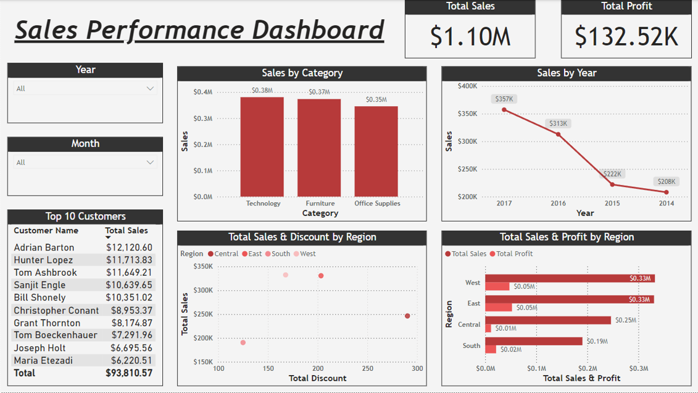

# E-commerce-Sales-Performance-Dashboard
##  Project Description

I built an E-commerce Sales Performance Dashboard using **MySQL** and **Power BI** to analyze sales trends, top 10 customers, regional performance and category-wise sales.

##  Key Features
- Interactive filters for Year and Month
- Sales trends from 2014 to 2017
- Top 10 customers by sales
- Sales and discount breakdown by region
- Total sales and profit by category

##  Tools Used
- Power BI
- MySQL

##  Dataset
**Sample Superstore Dataset** (Kagggle)

##  Key Insights
- **Total Sales:** $1.10M  
- **Total Profit:** $132.52K  
- **Best Performing Region:** West  
- **Top Product Category:** Technology

##  Dashboard Snapshot

##  Thankyou!
